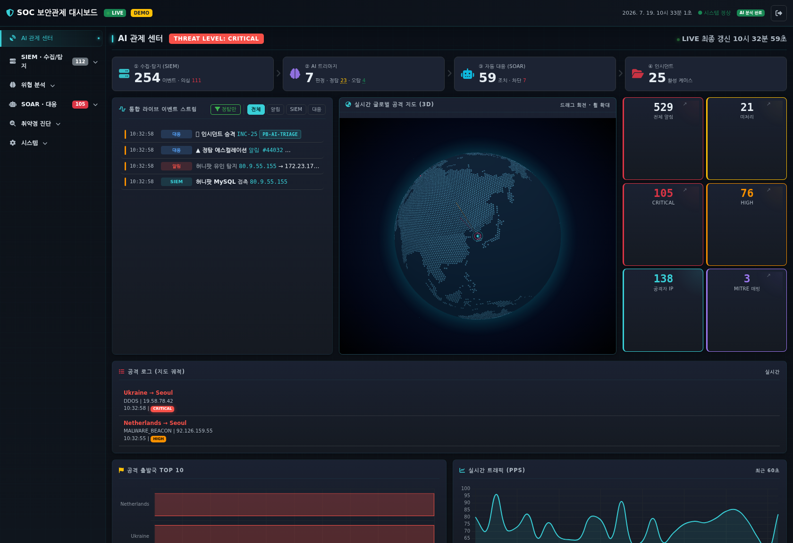
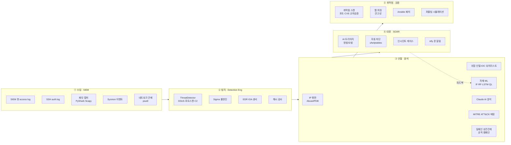

# AI 기반 SOC 보안관제 대시보드

> Flask 기반 **실시간 보안관제(SOC) 플랫폼** — 운영 중인 자동매매 홈서버(KR·USA)를 대상으로
> 침해 시도를 실시간 관제하고, AI로 **정탐(True Positive)과 오탐(False Positive)을 구분**하며,
> 탐지부터 자동대응(SOAR)·취약점 관리까지 SOC 업무 흐름을 하나의 대시보드로 구현했습니다.


실제 SOC 운영 개념(SIEM · SOAR · EDR · Threat Intelligence · Detection Engineering ·
Vulnerability Management · Purple Team · SOC Metrics)을 **34개 모듈 / 약 11,000 LOC**로 구현한 **개인 학습·포트폴리오 프로젝트**입니다.
모든 모듈은 **데모 fallback**을 갖춰 실제 센서(Npcap·Sysmon·nmap·ansible 등) 없이도 전체 기능이 동작합니다.



> 📸 **화면 중심 소개는 [docs/PORTFOLIO.md](docs/PORTFOLIO.md)** 에서 12개 패널을 스크린샷으로 볼 수 있습니다.

---

## 핵심 차별점 — "오탐과의 싸움"

SOC의 실무 난제는 알림 홍수 속에서 **진짜 위협만 골라내는 것**입니다. 이 프로젝트는 오탐 저감을 여러 계층에서 다룹니다.

| 기법 | 구현 | 효과 |
|------|------|------|
| **신뢰도 스코어링** | `threat_detector._confidence()` — IP 평판·내부망 여부·행위 가중 | 임계값 미만은 '오탐 의심'으로 억제 |
| **취약점 교차검증** | `vuln_scanner` — nmap/vulners CVE를 실제 apt 패치상태와 대조 | 백포트 패치된 CVE를 오탐으로 판별 |
| **AI 트리아지** | `soar` — 정탐→에스컬레이션/자동차단, 오탐→자동 종결 | 분석가 피로도 감소 |
| **ML 피드백 루프** | `ml_analyst` Q-Learning — FP 버튼 → 보상 → 임계값 자동 튜닝 | 운영하며 스스로 정밀도 향상 |
| **퍼플팀 회귀검증** | `purple_team` — 7종 모의공격을 실제 탐지엔진에 주입 | 룰 변경 후 탐지 커버리지 검증 |
| **킬체인 상관관계** | `correlation` — 산발적 알림을 같은 출발지·MITRE 전술 순서로 캠페인화 | 다단계 공격을 단건 알림에 묻히지 않게 |
| **허니팟** | `honeypot` — 유인 서비스 접촉은 오탐이 거의 없는 고신뢰 침해지표 | 진짜 공격자를 확실하게 식별 |
| **SOC 운영 지표** | `soc_metrics` — MTTD/MTTR/MTTA·오탐율·처리량 계량 | 관제 성숙도를 수치로 관리 |

---

## SOC 업무 흐름 아키텍처



**탐지→대응 파이프라인**

```
위협 탐지 → Alert 생성 → SocketIO 실시간 스트림
  → 신뢰도 평가(정탐/오탐 억제) → AI 트리아지(Claude + 자체 ML)
  → SOAR: 정탐=에스컬레이션·자동차단 / 오탐=자동종결
  → 인시던트 케이스화 → 정탐·CRITICAL만 폰(ntfy) 통보
```

---

## 기능 상세 (SOC 도메인별)

### ① 수집 · SIEM
- **SIEM** — 자동매매 봇 access log 수집·정규화, 침해 프로브 탐지 (`access_log_parser`)
- **SSH 인증 관제** — `/var/log/auth.log` 실시간 tail, 브루트포스 탐지 (`authlog_parser`)
- **패킷 분석** — PyShark 캡처, Scapy 조작, pps/bps·Top Talkers (`packet_analyzer`)
- **Sysmon** — 프로세스 생성·네트워크·자격증명 접근 이벤트 (`sysmon_parser`)
- **네트워크 관제** — 활성 연결·리스닝 포트·대역폭, 서비스 헬스체크 (`net_monitor`)
- **Syslog 수신** — 원격 서버(자동매매 KR/USA)의 접속 시도를 UDP/TCP로 실시간 수집·분류 (`syslog_receiver`)
- **허니팟** — SSH/Telnet/MySQL/Redis 등 유인 서비스 리스너, 접촉=고신뢰 침해지표 (`honeypot`)

### ② 탐지 · Detection Engineering
- **위협 탐지** — DDoS · 포트스캔 · 악성코드 C2, 신뢰도 스코어링 (`threat_detector`)
- **Sigma 룰엔진** — 업계 표준 탐지룰, 룰 파일만 추가하면 탐지 확장 (`sigma_engine`)
- **EDR** — psutil 기반 프로세스 IOA(리버스셸·웹셸·마이너·스캐너), 안전한 프로세스 종료 (`edr`)
- **해시 검사** — MD5/SHA256 악성 DB 대조, EICAR 검증 (`hash_checker`)
- **MITRE ATT&CK** — 위협·Sysmon 이벤트를 14 Tactic × Technique 매트릭스에 실시간 매핑 (`mitre_attack`)

### ③ 위협 인텔 · 분석
- **IP 평판** — AbuseIPDB 조회(캐시·데모 fallback), 정탐 근거 강화 (`ip_reputation`)
- **위협 인텔** — 악성 IP/URL 피드 관리 (`threat_intel`)
- **IOC 워치리스트** — 주시할 IP/도메인/해시 등록 → 이후 알림 등장 시 히트 집계·실시간 통보(능동 헌팅) (`watchlist`)
- **킬체인 상관관계** — 같은 출발지 알림을 시간 윈도우로 묶어 MITRE 전술 순서 공격 스토리로 구성 (`correlation`)
- **자체 ML** — Isolation Forest · Random Forest · LSTM Autoencoder · Q-Learning (`ml_analyst`)
- **Claude AI** — 비동기 큐 기반 알림 분석·대응 권고·챗봇 (`ai_analyst`)
- **의사결정 지원** — 위협 그룹핑 + 정오탐 학습 prior (`decision_support`)

### ④ 대응 · SOAR
- **SOAR** — AI 트리아지(정탐 에스컬레이션 / 오탐 자동종결), 자동 차단(simulate/ufw/iptables), 차단 TTL·allowlist (`soar`)
- **인시던트 관리** — 알림 케이스화·상태 추적 (`incidents`)
- **푸시 알림** — ntfy로 정탐·차단만 폰 통보(오탐 스팸 차단) (`notifier`)
- **일일 AI 리포트** — 전 모듈 지표 집계 → Claude 브리핑 (`daily_report`)

### ⑤ 취약점 관리 · 검증
- **취약점 스캔** — nmap 포트·서비스·CVE(vulners), **apt 교차검증으로 정탐/오탐 판정**, 원격은 ansible 조회 (`vuln_scanner`)
- **웹 퍼징** — 엔드포인트 견고성 점검(5xx·행·입력반사), 사설 대상만·GET 전용·rate-limit (`web_fuzzer`)
- **Ansible 패치** — 다중 서버 일괄 명령/패치, dry-run 기본·파괴적 명령 차단 (`patch_manager`)
- **퍼플팀** — 안전한 모의공격으로 탐지 파이프라인 회귀검증 (`purple_team`)

### ⑥ SOC 운영 · 거버넌스
- **운영 지표** — MTTR/MTTA·오탐율·종결율·일별 추세·요일×시간 히트맵·TOP 위협/공격자 (`soc_metrics`)
- **감사 로그** — 누가·언제·무엇을(알림 ACK/종료·SOAR 차단·인시던트 변경) append-only 기록 (`audit_log`)
- **알림 보존·아카이브** — 보존기간 경과 알림을 아카이브 테이블로 무손실 이동, 활성 DB 경량 유지 (`alert_store`)
- **모듈 헬스** — 전 모듈 상태(real/demo/off/live)를 중앙에서 방어적 집계 (`system_health`)

### 플랫폼
- **인증** — 로그인(pbkdf2 해시), IP별 브루트포스 락아웃, 세션 가드 (`auth`)
- **공격 지도** — GeoIP 기반 공격 출발지 시각화 (`geoip`)
- **알림 저장소** — 알림 영속화(alerts.db)·전체 이력 검색·집계 (`alert_store`)

---

## 안전 설계 — 운영 서버 보호

실제 자동매매 봇이 도는 홈서버가 대상이므로, **오작동이 서비스를 중단시키지 않도록** 방어적으로 설계했습니다.

- 취약점 스캔은 **connect() 스캔만** (비파괴), 실제 패치는 **절대 자동 실행 안 함**(dry-run 기본 + `PATCH_APPLY_ENABLED` 게이트)
- 일괄 명령은 **파괴적 명령 차단**(`rm -rf`·`reboot`·`mkfs` 등 blocklist)
- 웹 퍼징은 **사설/Tailscale 대상만** 허용(공인 IP 거부), 기본 GET 전용, rate-limit
- SOAR 자동 차단은 **사설·CGNAT·Tailscale·자기 자신 절대 차단 금지**, 차단 TTL 자동 만료
- EDR 프로세스 종료는 PID1·시스템 프로세스 보호, 기본 simulate 모드

---

## 기술 스택

- **백엔드** — Flask 3 · Flask-SocketIO(threading) · Blueprint REST API
- **탐지·분석** — PyShark · Scapy · nmap/vulners · Sigma · psutil · scikit-learn · (선택)TensorFlow
- **AI** — Anthropic Claude API(비동기 큐) · 자체 IF/RF/LSTM/Q-Learning
- **자동화** — Ansible(ad-hoc·플레이북) · ntfy
- **프론트** — Bootstrap 5 · Chart.js · 순수 SVG 시각화 · Leaflet · Socket.IO
- **테스트** — pytest **153개** (탐지·SOAR·인증·스캐너·퍼저·안전장치)

---

## 빠른 시작

```bash
# 1. 가상환경 + 의존성
python -m venv venv && ./venv/bin/pip install -r requirements.txt

# 2. 환경 설정 (.env 편집 — API 키·대상 서버 등)
#    DEMO_MODE=True 면 실제 센서 없이 가상 데이터로 동작

# 3. 실행 (기본 포트 8080, 예시는 5055)
PORT=5055 ./venv/bin/python app.py

# 4. 테스트
./venv/bin/pytest tests/
```

브라우저에서 `http://localhost:5055` 접속 (로그인: `.env`의 `DASH_USERNAME` / `DASH_PASSWORD`).

### 선택 연동 (없어도 데모로 동작)

| 기능 | 활성화 방법 |
|------|-------------|
| Claude AI 분석 | `.env ANTHROPIC_API_KEY` |
| IP 평판 실조회 | `.env ABUSEIPDB_API_KEY` (무료 1000/일) |
| 취약점 스캔(정밀) | `apt install nmap` + vulners 스크립트 |
| 원격 서버 관제 | `.env ANSIBLE_TARGETS="이름=user@host;..."` + SSH 키 |
| 폰 푸시 알림 | ntfy 앱 설치 + `.env NTFY_ENABLED=True NTFY_TOPIC=...` |
| 외부 접속 | Tailscale(`HOST=0.0.0.0`) |

---

## 프로젝트 구조

```
SOC_DashBoard/
├── app.py                    # Flask 앱 팩토리 · SocketIO 이벤트
├── wiring.py                 # 서비스 생성·교차배선·시작(build/start_services)
├── config.py                 # 환경변수 기반 설정
├── modules/                  # 34개 관제 모듈 (SOC 도메인별)
│   ├── 수집    access_log_parser · authlog_parser · packet_analyzer · sysmon_parser · net_monitor
│   ├── 탐지    threat_detector · sigma_engine · edr · hash_checker · mitre_attack
│   ├── 인텔    ip_reputation · threat_intel · watchlist · correlation · ml_analyst · ai_analyst · decision_support
│   ├── 대응    soar · incidents · notifier · daily_report
│   ├── 취약점  vuln_scanner · web_fuzzer · patch_manager · purple_team
│   ├── 운영    soc_metrics · audit_log · system_health
│   └── 플랫폼  auth · geoip · alert_store · system_info
├── api/                      # REST API Blueprint (도메인별 분리 + _common)
├── templates/
│   ├── dashboard.html        # 레이아웃·사이드바
│   └── panels/               # 패널별 UI 조각 (29개, Jinja include)
├── static/js/dash/           # 패널별 JS (01~14, 순서대로 로드)
├── tests/                    # pytest 153개
├── data/                     # 모델·룰·리포트·해시 DB
└── docs/                     # 상세 문서
```

## 문서

- 📸 **[포트폴리오 (화면 소개)](docs/PORTFOLIO.md)** — 스크린샷으로 보는 대시보드·기술 소개
- [아키텍처](docs/architecture.md) · [모듈 상세](docs/modules.md) · [연동 가이드](docs/integrations.md)
- [탐지 규칙](docs/detection_rules.md) · [MITRE ATT&CK](docs/mitre_attack.md) · [AI 모델](docs/ml_models.md)

## 라이선스

MIT License · 개인 학습/포트폴리오 프로젝트
