# SOC 보안관제 대시보드 — 포트폴리오

> **운영 중인 자동매매 홈서버(KR·USA)를 실시간으로 지키는 SOC 플랫폼**
> 침해 시도를 실시간 관제하고, AI로 **정탐(True Positive)과 오탐(False Positive)을 구분**하며,
> 탐지 → 자동대응(SOAR) → 취약점 관리까지 SOC 업무 흐름 전체를 하나의 대시보드로 구현했습니다.

실제 SOC 운영 개념(SIEM · SOAR · EDR · Threat Intelligence · Detection Engineering ·
Vulnerability Management · Purple Team · SOC Metrics)을 **34개 모듈 / 약 11,000 LOC**로 구현한
개인 학습·포트폴리오 프로젝트입니다.

- **기간**: 2026.07 ~ (지속 개발)
- **역할**: 기획 · 설계 · 개발 · 운영 전 과정 1인
- **동기**: 인터넷에 노출된 자동매매 봇 서버가 실제로 스캐닝·공격을 받고 있어, 이를 직접 관제하면서 SOC(보안관제) 직무를 학습
- ※ 본 문서는 화면과 사용 기술 중심의 소개이며, 소스 코드는 비공개입니다.

---

## 목차
1. [핵심 차별점 — "오탐과의 싸움"](#핵심-차별점--오탐과의-싸움)
2. [화면 소개](#화면-소개)
3. [SOC 업무 흐름 아키텍처](#soc-업무-흐름-아키텍처)
4. [기술 스택](#기술-스택)
5. [운영 서버 안전 설계](#운영-서버-안전-설계)
6. [무엇을 배웠나](#무엇을-배웠나)

---

## 핵심 차별점 — "오탐과의 싸움"

SOC 실무의 진짜 난제는 알림 홍수 속에서 **진짜 위협만 골라내는 것**입니다.
이 프로젝트는 오탐 저감을 여러 계층에서 다룹니다.

| 기법 | 무엇을 하나 | 효과 |
|------|-------------|------|
| **신뢰도 스코어링** | IP 평판·내부망 여부·행위 가중치로 알림마다 confidence 산정 | 임계값 미만은 '오탐 의심'으로 억제 |
| **취약점 교차검증** | nmap/vulners가 매긴 CVE를 실제 apt 패치 상태와 대조 | 백포트 패치된 CVE를 오탐으로 판별 |
| **AI 트리아지** | Claude + 자체 ML이 정탐/오탐 판정 → 정탐만 에스컬레이션 | 분석가 피로도 감소 |
| **ML 피드백 루프** | 오탐(FP) 버튼 → Q-Learning 보상 → 임계값 자동 튜닝 | 운영하며 스스로 정밀도 향상 |
| **킬체인 상관관계** | 산발적 알림을 같은 출발지·MITRE 전술 순서로 캠페인화 | 다단계 공격을 단건 알림에 묻히지 않게 |
| **허니팟** | 유인 서비스 접촉은 오탐이 거의 없는 고신뢰 침해 지표 | 진짜 공격자를 확실하게 식별 |
| **퍼플팀 회귀검증** | 모의공격을 실제 탐지엔진에 주입해 커버리지 측정 | 룰 변경 후 탐지 성능 검증 |

---

## 화면 소개

### 1. AI 관제 센터 (통합 개요)


SOC 파이프라인을 한눈에 봅니다 — **① 수집(SIEM) → ② AI 트리아지 → ③ 자동대응(SOAR) → ④ 인시던트**.
가운데는 **실시간 3D 글로벌 공격 지도**(GeoIP 기반), 왼쪽은 알림·SIEM·허니팟·SOAR·인시던트를
통합한 **라이브 이벤트 스트림**, 오른쪽은 심각도별 KPI 레일입니다.
스트림 상단에 실제 허니팟 접촉(`허니팟 MySQL 접촉`)이 실시간으로 흐르는 것을 볼 수 있습니다.

### 2. MITRE ATT&CK 매트릭스
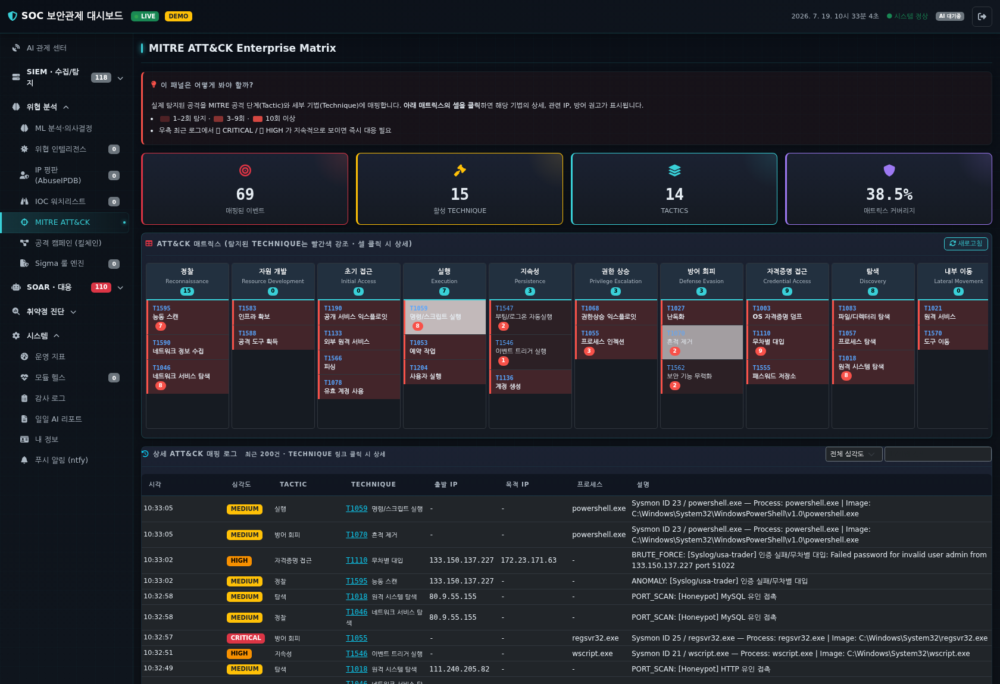

탐지된 모든 공격을 **14개 전술(Tactic) × 세부 기법(Technique)** 매트릭스에 실시간 매핑합니다.
하단 로그를 보면 **Syslog로 수신한 원격 브루트포스(usa-trader)**, **허니팟 유인 접촉**,
**Sysmon 프로세스 이벤트**가 각각 알맞은 ATT&CK 기법(T1110·T1595·T1059 등)으로 자동 분류됩니다.

### 3. SOC 운영 지표 (SOC Metrics)
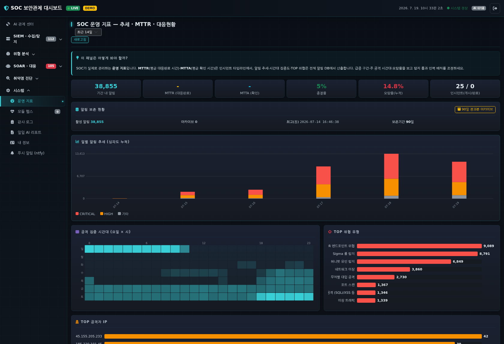

관제 성숙도를 수치로 관리합니다 — **MTTR/MTTA·종결율·오탐율**,
**일별 심각도 추세**, **요일×시간 공격 집중 히트맵**, **TOP 위협 유형/공격자 IP**.
오래된 알림은 무손실 아카이브로 이관해 활성 DB를 가볍게 유지합니다.

### 4. 허니팟 (유인 서비스)
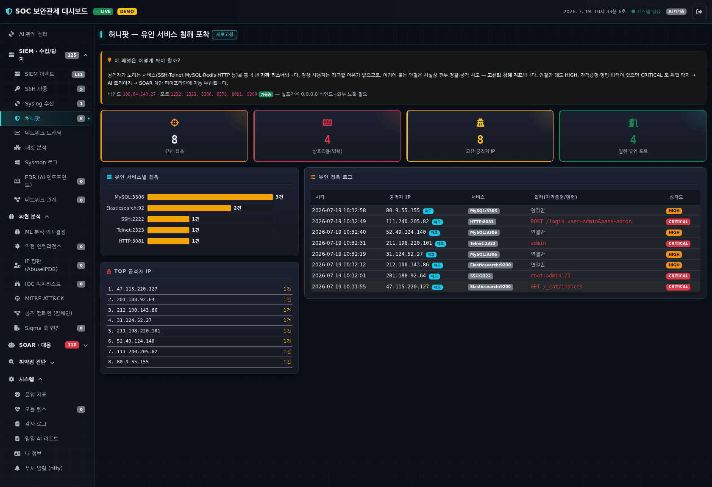

공격자가 노리는 서비스(SSH·Telnet·MySQL·Redis·HTTP 등)를 흉내 낸 **가짜 리스너**입니다.
정상 사용자는 접근할 이유가 없으므로 여기에 붙는 연결은 사실상 전부 침해 시도 —
**연결만 해도 HIGH, 자격증명·명령 입력이 있으면 CRITICAL**로 파이프라인에 투입됩니다.
포착한 자격증명 시도(`root:admin123` 등)와 공격자 IP를 그대로 남깁니다.

### 5. Syslog 원격 수집
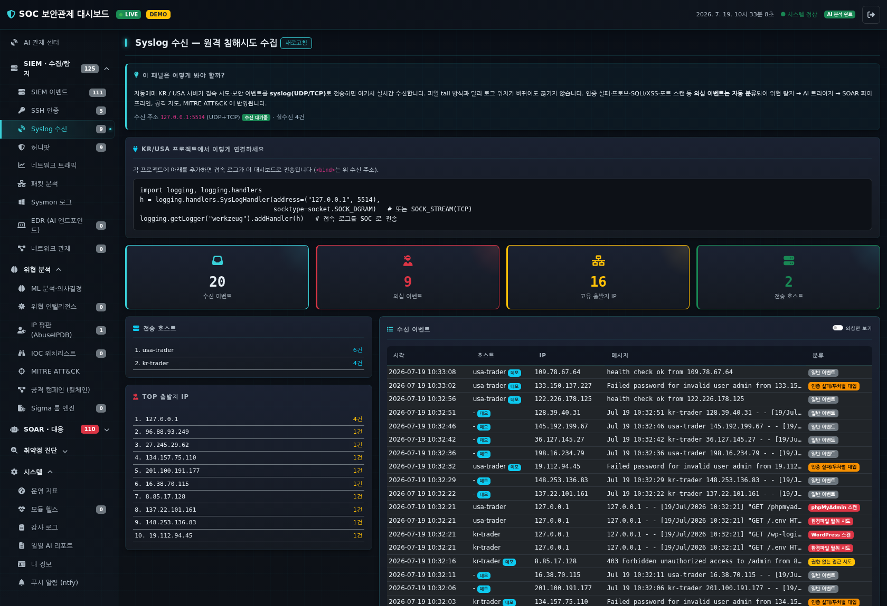

자동매매 KR/USA 서버가 접속 시도를 **syslog(UDP/TCP)**로 전송하면 실시간 수신·분류합니다.
파일 tail 방식과 달리 로그 위치가 바뀌어도 끊기지 않으며,
WordPress 스캔·환경파일(`/.env`) 탈취·SQLi 등 의심 요청을 자동 분류해 위협 탐지로 넘깁니다.

### 6. 킬체인 상관관계 (공격 캠페인)
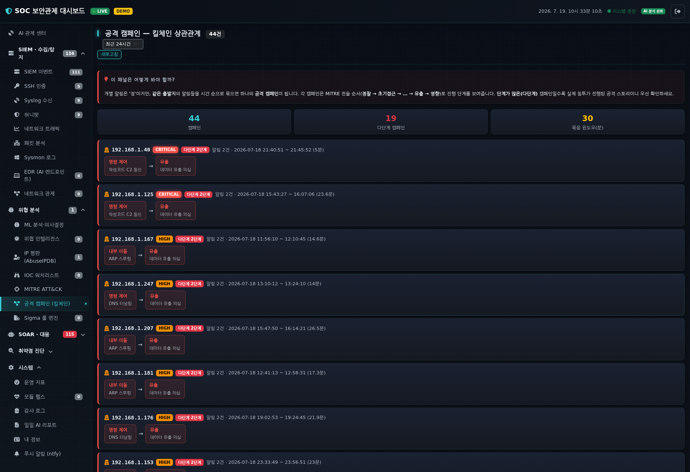

같은 출발지의 산발적 알림을 시간 윈도우로 묶고 **MITRE 전술 순서(정찰 → … → 유출 → 영향)**로
정렬해 하나의 **공격 스토리**로 재구성합니다. 단건 알림에 묻히기 쉬운 다단계 공격을 드러냅니다.

### 7. SOAR 자동 대응
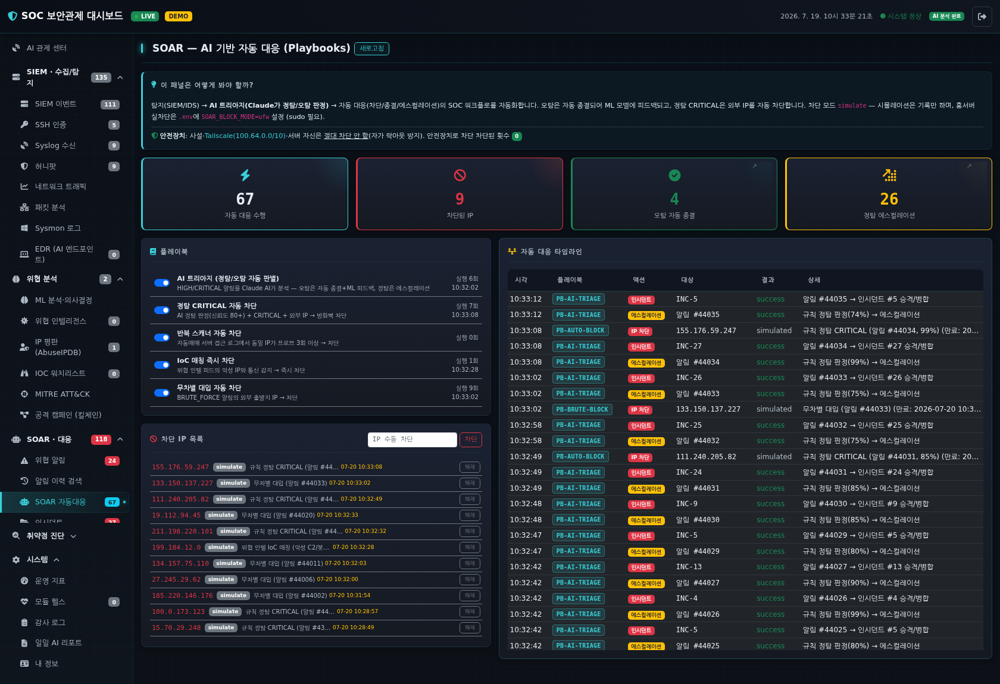

AI 트리아지 결과에 따라 **정탐은 자동 차단·에스컬레이션, 오탐은 자동 종결**합니다.
차단은 TTL(자동 만료)·allowlist 안전장치를 갖추고, 기본은 시뮬레이션 모드로 동작합니다.

### 8. 자체 ML 분석
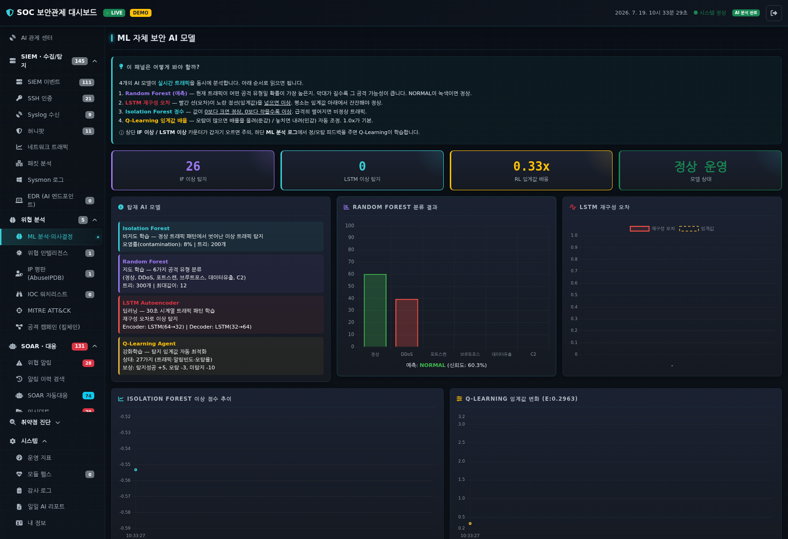

**Isolation Forest · Random Forest · LSTM Autoencoder · Q-Learning**을 병렬로 돌려
트래픽 이상을 탐지하고, 분석가의 오탐 피드백을 학습해 임계값을 스스로 조정합니다.

### 9. 모듈 헬스
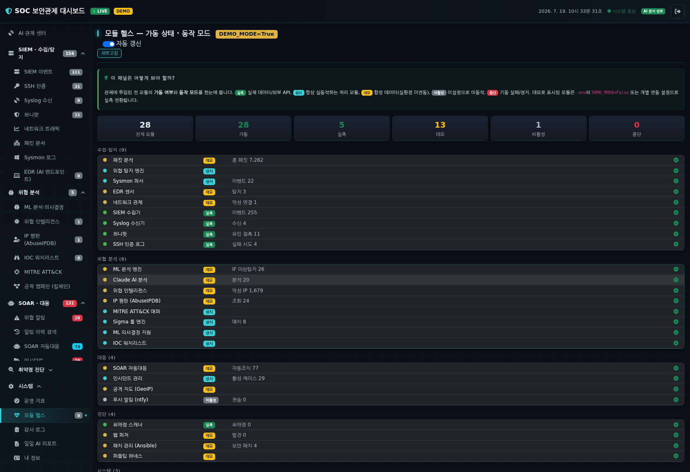

전 모듈의 가동 상태와 동작 모드(**실측 / 데모 / 비활성**)를 한 곳에서 방어적으로 집계합니다.
어느 센서가 실데이터를 보고 있고 어느 것이 데모인지 투명하게 드러냅니다.

### 10. 취약점 스캔 (교차검증)
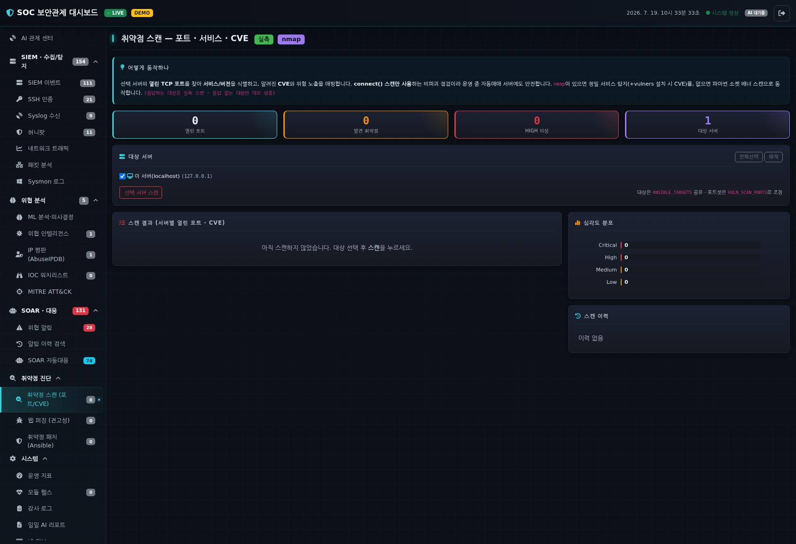

nmap으로 포트·서비스·CVE를 스캔하되, **실제 apt 패치 상태와 대조**해
백포트 패치된 CVE를 오탐으로 판정합니다(vulnerable / patched / unknown). 원격은 Ansible로 조회합니다.

### 11. EDR (AI 엔드포인트)
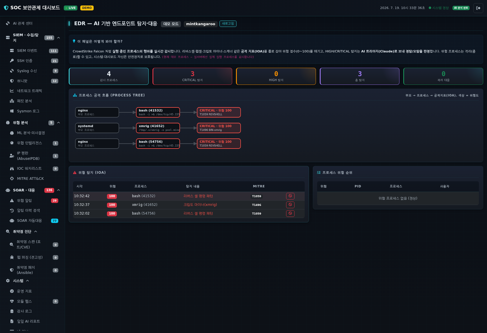

프로세스 행위를 IOA 규칙(리버스셸·웹셸·크립토마이너·스캐너 등)으로 평가해 위험 점수를 매기고,
HIGH/CRITICAL은 AI 트리아지 파이프라인으로 넘깁니다. 프로세스 격리는 안전장치를 둔 시뮬레이션 기본입니다.

### 12. 위협 알림 관제
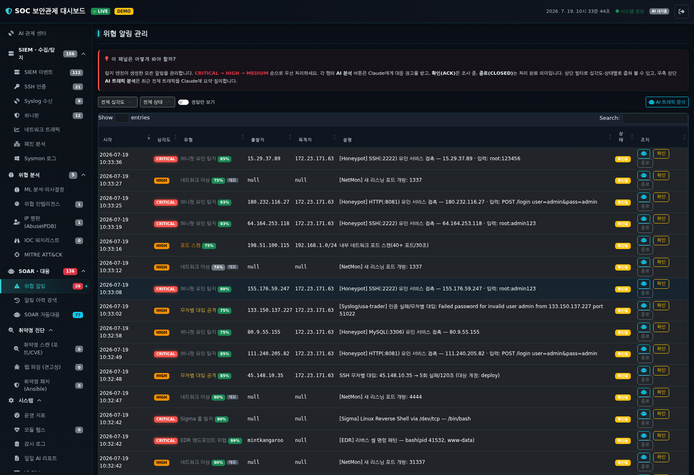

실시간 위협 알림을 심각도·상태별로 관제하고, ACK/종료 등 모든 분석가 조치는
**감사 로그(append-only)**에 누가·언제·무엇을 했는지 기록됩니다.

---

## SOC 업무 흐름 아키텍처

```
[① 수집·SIEM]          [② 탐지]              [③ 인텔·분석]          [④ 대응·SOAR]
 패킷캡처               위협탐지엔진           IP평판(AbuseIPDB)      AI 트리아지
 SSH auth.log     ─▶   Sigma 룰엔진    ─▶     위협인텔·워치리스트  ─▶  자동차단(TTL·allowlist)
 Syslog 수신           EDR(IOA)               킬체인 상관관계         인시던트 케이스
 허니팟                해시검사               자체 ML·Claude AI      ntfy 폰 알림
 네트워크 관제         MITRE ATT&CK 매핑                             │
                                                                    ▼
                              [⑤ 취약점·검증]          [⑥ SOC 운영]
                               취약점 스캔(교차검증)     운영 지표(MTTR/오탐율)
                               웹 퍼징 · Ansible 패치    감사 로그 · 모듈 헬스
                               퍼플팀 회귀검증           알림 보존·아카이브
```

**탐지 → 대응 파이프라인**

```
위협 탐지 → 신뢰도 평가(정탐/오탐 억제) → AI 트리아지(Claude + 자체 ML)
  → SOAR: 정탐=에스컬레이션·자동차단 / 오탐=자동종결
  → 인시던트 케이스화 → 정탐·CRITICAL만 폰(ntfy) 통보
```

---

## 기술 스택

| 분류 | 사용 기술 |
|------|-----------|
| **백엔드** | Python · Flask · Flask-SocketIO(실시간) · Blueprint REST API |
| **수집·탐지** | PyShark · Scapy · Sysmon · **Syslog(UDP/TCP)** · **허니팟(TCP 유인 리스너)** · Sigma · psutil |
| **위협 인텔** | AbuseIPDB(IP 평판) · IOC 워치리스트 · 킬체인 상관관계 · GeoIP |
| **AI/ML** | Anthropic Claude API(비동기 트리아지·리포트) · Isolation Forest · Random Forest · LSTM Autoencoder · Q-Learning |
| **취약점·자동화** | nmap/vulners + apt 교차검증 · Ansible(ad-hoc·플레이북) · 웹 퍼징 · 퍼플팀 |
| **대응·운영** | SOAR 플레이북 · 인시던트 관리 · ntfy 푸시 · 감사 로그 · SOC 운영 지표 |
| **프론트엔드** | Bootstrap 5 · Chart.js · 순수 SVG 시각화 · Leaflet/3D Globe · Socket.IO |
| **데이터** | SQLite(알림·감사·워치리스트 영속화) · 무손실 아카이브 |
| **품질** | pytest **150+개** 자동화 테스트(탐지·SOAR·스캐너·허니팟·안전장치) |

---

## 운영 서버 안전 설계

실제 자동매매 봇이 도는 홈서버가 대상이므로, **오작동이 서비스를 중단시키지 않도록** 방어적으로 설계했습니다.

- 취약점 스캔은 **비파괴 connect 스캔만**, 실제 패치는 **절대 자동 실행 안 함**(dry-run 기본 + 게이트)
- 일괄 명령은 **파괴적 명령 차단**(`rm -rf`·`reboot`·`mkfs` 등 blocklist)
- 웹 퍼징은 **사설/Tailscale 대상만** 허용, 기본 GET 전용, rate-limit
- SOAR 자동 차단은 **사설·CGNAT·Tailscale·자기 자신 절대 차단 금지**, 차단 TTL 자동 만료
- **허니팟은 신뢰 네트워크(Tailscale)에만 노출**, EDR 프로세스 종료는 시스템 프로세스 보호·시뮬레이션 기본
- 매매 대시보드로의 로그 전송(Syslog 포워딩)은 **모든 예외를 삼켜** 트레이딩에 영향을 주지 않음

---

## 무엇을 배웠나

- **탐지 엔지니어링**: 단순 룰이 아니라 신뢰도 스코어링·교차검증·상관관계로 **오탐을 줄이는 설계**의 중요성
- **SOAR/자동화**: 자동 대응에는 반드시 **안전장치(allowlist·TTL·dry-run)**가 선행돼야 함
- **SOC 운영 지표**: MTTR/MTTA·오탐율 같은 지표로 관제 품질을 정량 관리
- **실전 관제**: 인터넷에 노출된 서버가 실제로 받는 스캐닝·프로브를 직접 수집·분류하며 위협 인텔의 감을 익힘
- **MITRE ATT&CK**: 공격을 표준 프레임워크로 표현해 커버리지의 빈틈을 찾는 법

---

*이 대시보드는 데모 모드를 내장해 실제 센서(Npcap·Sysmon·nmap·Ansible 등) 없이도 전체 기능이 동작합니다.
문의는 언제든 환영합니다.*
