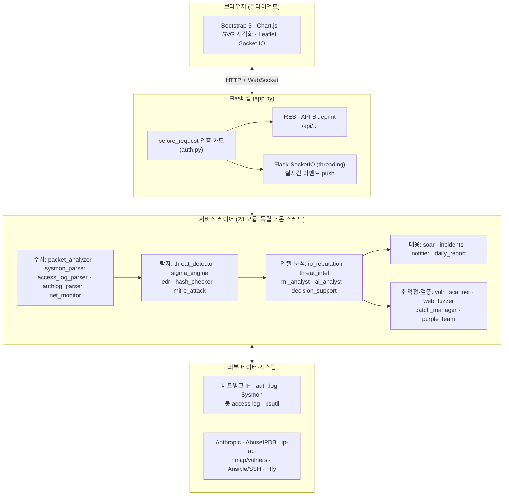
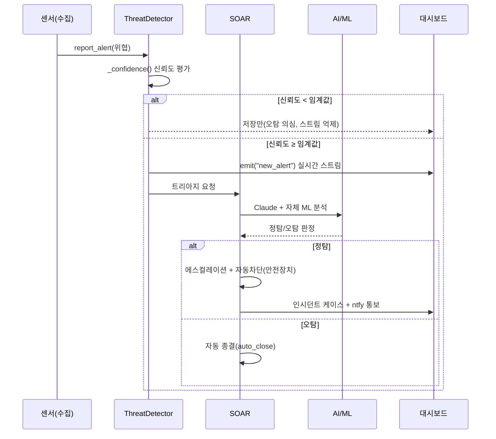

# 아키텍처 설명

## 전체 구조



Flask 앱 팩토리(`create_app`)가 각 서비스를 초기화해 `app.<name>` 으로 등록하고,
`socketio` 를 주입한다. 각 모듈은 `start()` / `stop()` / `get_*()` 인터페이스로 독립 동작하며
데모 fallback을 포함한다.

## 탐지 → 대응 파이프라인



## 주요 데이터 흐름

**실시간 패킷 분석**
```
네트워크 IF → PyShark/Scapy 캡처(스레드) → PacketAnalyzer._record_packet()
  → deque(maxlen) → 2초 주기 emit("packet_update") → Chart.js/DataTable
```

**자체 ML 분석**
```
packet_analyzer.get_stats() → ml_analyst.feed_traffic()(3초)
  → IF + RF + LSTM + Q-Learning 병렬 → emit("ml_analysis")
  → 사용자 FP 피드백 → Q-Learning 보상 → 임계값 자동 튜닝
```

**MITRE ATT&CK 매핑**
```
threat_detector._add_alert() / sysmon_parser._record_event()
  → mitre_tracker.map_threat() → hits[(tactic, technique)] += 1
  → emit("mitre_hit") → 매트릭스 셀 실시간 강조
```

**취약점 스캔 + 교차검증**
```
vuln_scanner.scan() → nmap -sV(+vulners) 또는 소켓 배너 스캔
  → _cross_validate(): 서비스→패키지 매핑 → apt 패치상태 대조
     (localhost=직접 apt/dpkg, 원격=ansible -m shell 읽기전용)
  → verdict: vulnerable(정탐) / patched(오탐) / unknown
  → emit("vulnscan_host")
```

## 스레드 구조

각 서비스는 독립 데몬 스레드로 실행되며, SocketIO emit은 `deque`·`Lock`으로 스레드 안전하게 처리한다.

| 스레드/워커 | 역할 |
|-------------|------|
| 패킷 캡처/emit | PyShark/Scapy 캡처(또는 데모) + 2초 주기 통계 전송 |
| Sysmon 읽기/emit | Windows 이벤트 로그(또는 데모) + 3초 주기 전송 |
| AI 워커 | Claude 분석 비동기 큐 처리 |
| SIEM/authlog tail | 봇 access log · auth.log 실시간 tail |
| EDR/NetMon 스캔 | psutil 주기 스캔(프로세스 IOA · 연결/포트) |
| 취약점 스캔/퍼징 | 온디맨드 백그라운드(사용자 트리거) |
| 일일 리포트 | 정해진 시각 자동 브리핑 |

## 온디맨드 vs 상시

- **상시(주기)**: 패킷·Sysmon·SIEM·authlog·EDR·NetMon·ML·일일리포트
- **온디맨드(트리거)**: 취약점 스캔, 웹 퍼징, 퍼플팀 시뮬레이션, Ansible 패치/명령, AI 챗봇

## 보안·안전 고려사항

- 패킷 캡처·auth.log는 권한 필요 / API 키는 `.env` 관리(하드코딩 금지) / `SECRET_KEY` 랜덤 고정
- 대시보드 인증: pbkdf2 해시 + IP별 브루트포스 락아웃 + 세션 가드(전 라우트 `before_request`)
- **운영 서버 보호**: 취약점 스캔은 비파괴 connect, 패치는 dry-run 기본+게이트, 파괴적 명령 blocklist,
  퍼징은 사설 대상만·GET 전용, SOAR 차단은 사설·Tailscale·자기자신 allowlist 보호
- Tailscale로 외부 접속 시 HTTP이므로 세션 쿠키 `Secure`는 환경변수로 제어
